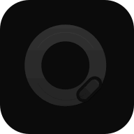
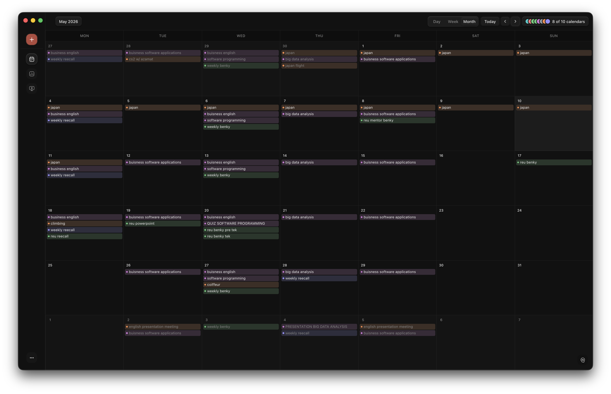

<p align="center">
  
</p>

# Qali

Qali is a local-first Google Calendar for macOS. It combines a fast calendar,
multiple Google accounts, reference time zones, on-device Insights, and an
optional Codex assistant in one desktop app.

Calendar data is stored on your Mac. Reads and edits keep working offline,
pending changes sync when the connection returns, and Google credentials stay
in macOS Keychain.


## What Qali does

- Shows day, week, and month views with one primary time zone and up to two
  reference clocks.
- Connects up to eight Google accounts while keeping credentials, sync state,
  calendar visibility, and color separate for each account.
- Creates, edits, and deletes events offline, then reconciles each local change
  with Google without adding a second copy.
- Opens every command from `⌘K`, supports editable shortcuts, and maps `⌘1`
  through `⌘9` to reorderable app sections.
- Summarizes the last 28 days with local event counts, scheduled time, daily
  load, and weekday patterns.
- Uses an optional Codex assistant for calendar questions and proposed changes.
  Qali applies a change only after you confirm it.

Qali is built for Apple Silicon Macs running macOS 12 or later.

## Month at a glance

The month view keeps recurring schedules, calendar colors, and several weeks
of context visible without opening each day.



## Calendar Insights

Insights are computed from the calendar data already stored on the device. The
28-day view shows event count, scheduled time, average and longest events,
active days, daily load, event cadence, weekday patterns, and time-of-day
distribution.


## Searchable settings

Settings search finds individual controls, not only section names. Calendar
density, default view, default creation calendar, time zones, theme, sounds,
shortcuts, Google accounts, assistant status, backups, and updates are managed
in the app.


## How the desktop app is separated

The Electron main process owns local Convex, macOS Keychain, Google OAuth,
Calendar API traffic, updates, filesystem access, and the separately installed
Codex process. The React renderer is untrusted and can call only the versioned,
runtime-validated preload contract.

| Path | Responsibility |
| --- | --- |
| `apps/desktop` | Electron main process, preload, OAuth, updates, packaging |
| `apps/web` | Calendar, Insights, Settings, commands, assistant UI |
| `apps/www` | Public product and legal site |
| `packages/backend` | Local Convex schema, sync queue, assistant proposals |
| `packages/desktop-contracts` | Runtime-validated renderer/main contracts |
| `packages/domain` | Provider-independent calendar rules |
| `packages/ui` | Shared design tokens and interface primitives |
| `scripts/desktop` | Reproducible package, verification, smoke, and release tools |

Read [the architecture guide](docs/architecture.md) for process ownership,
trust boundaries, and data flow. The [documentation index](docs/README.md)
links the setup, recovery, privacy, and release guides.

## Develop Qali

Install Git and [Bun 1.3.14](https://bun.sh/docs/installation), then run:

```bash
git clone https://github.com/mielsense/qali.git
cd qali
bun install --frozen-lockfile
bun run check-types
bun run test
bun run build
```

The desktop development lane runs Convex locally. It does not require Convex
Cloud, Docker, an OpenAI API key, or Google credentials in renderer environment
variables. Release-owner OAuth setup is documented separately, and secrets
must never be committed.

Read [CONTRIBUTING.md](CONTRIBUTING.md) before changing native boundaries,
calendar sync, packaging, or release code. Coding agents should also read
[AGENTS.md](AGENTS.md).

## Package and verify the macOS app

Production packaging requires a clean reviewed commit and the release-owned
Google Desktop OAuth input. The local QA lane is explicit and cannot publish an
update.

```bash
# Local QA candidate from an intentionally dirty tree
bun scripts/desktop/generate-release-input-allowlist.ts --accept-local-path-set-changes
bun run desktop:generate-output-policy:local
bun run desktop:generate-release-input-allowlist
bun run desktop:package:local
bun run desktop:verify-app:local
bun run desktop:smoke-packaged:local

# Clean production candidate
bun run desktop:package
bun run desktop:verify-app
bun run desktop:smoke-packaged
```

The complete procedures are in:

- [Build and install](docs/desktop/build-install.md)
- [Google Cloud and OAuth](docs/desktop/google-cloud-setup.md)
- [Backup, recovery, reset, and uninstall](docs/desktop/data-backup-recovery.md)
- [Privacy and diagnostics](docs/desktop/privacy-and-diagnostics.md)
- [Signed macOS release runbook](docs/desktop/release-macos.md)

## Security and privacy

Qali handles calendar metadata and Google credentials. Report vulnerabilities
privately according to [SECURITY.md](SECURITY.md). Do not put real calendar
records, OAuth secrets, refresh tokens, Keychain contents, signing material, or
personal diagnostics in issues or fixtures.

## Origin and license

This desktop application is based on the original
[Qali calendar UI](https://github.com/NatnaelTaddese/qali) by Natnael Taddese
and contributors. The desktop architecture, local database, multi-account sync,
assistant, Insights, settings, packaging, and release system were developed in
this repository. See [NOTICE](NOTICE) for attribution.

Qali is licensed under the [GNU Affero General Public License v3.0](LICENSE).
