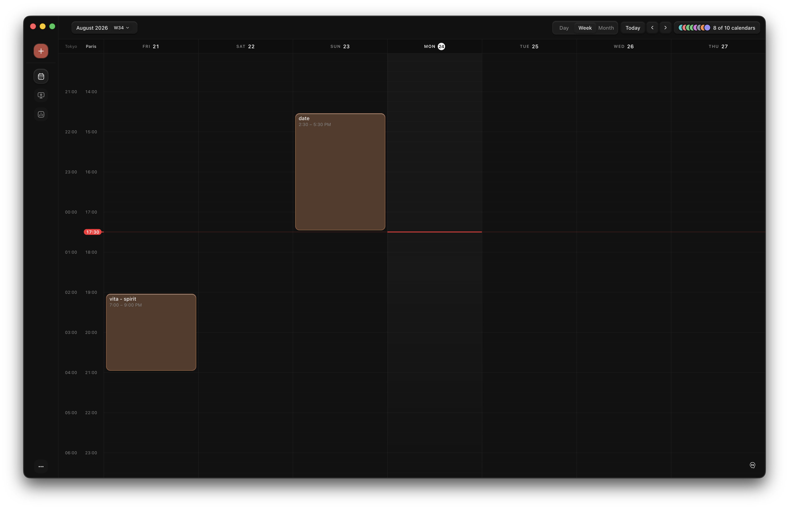
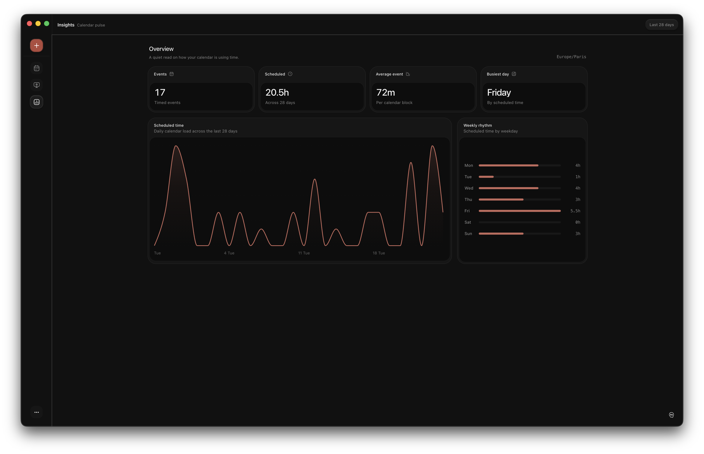
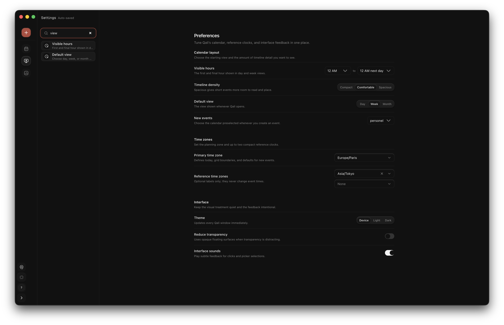

# Qali documentation

Qali is a local-first macOS calendar. The desktop process owns the database,
Google credentials, sync queue, updates, and Codex integration. The renderer is
limited to a versioned preload contract.

## Start here

- [Architecture and repository map](architecture.md) explains the process
  boundaries, data flow, sync identity, and verification strategy.
- [Build and install](desktop/build-install.md) covers local prerequisites,
  packaging, verification, installation, and launch troubleshooting.
- [Google Cloud and OAuth](desktop/google-cloud-setup.md) separates release-owner
  configuration from the account connection flow inside Qali.
- [Local data and recovery](desktop/data-backup-recovery.md) documents backups,
  restore, reset, disconnect, and uninstall behavior.
- [Privacy and diagnostics](desktop/privacy-and-diagnostics.md) lists what stays
  on the Mac, what can leave it, and what the logs exclude.
- [macOS release runbook](desktop/release-macos.md) covers signing,
  notarization, immutable artifacts, publication, and rollback.

## Product views

| Calendar Insights | Searchable settings |
| --- | --- |
|  |  |

These screenshots contain demonstration calendar data. Repository fixtures,
tests, and documentation must not contain personal calendar records, OAuth
secrets, refresh tokens, Keychain values, or signing credentials.
